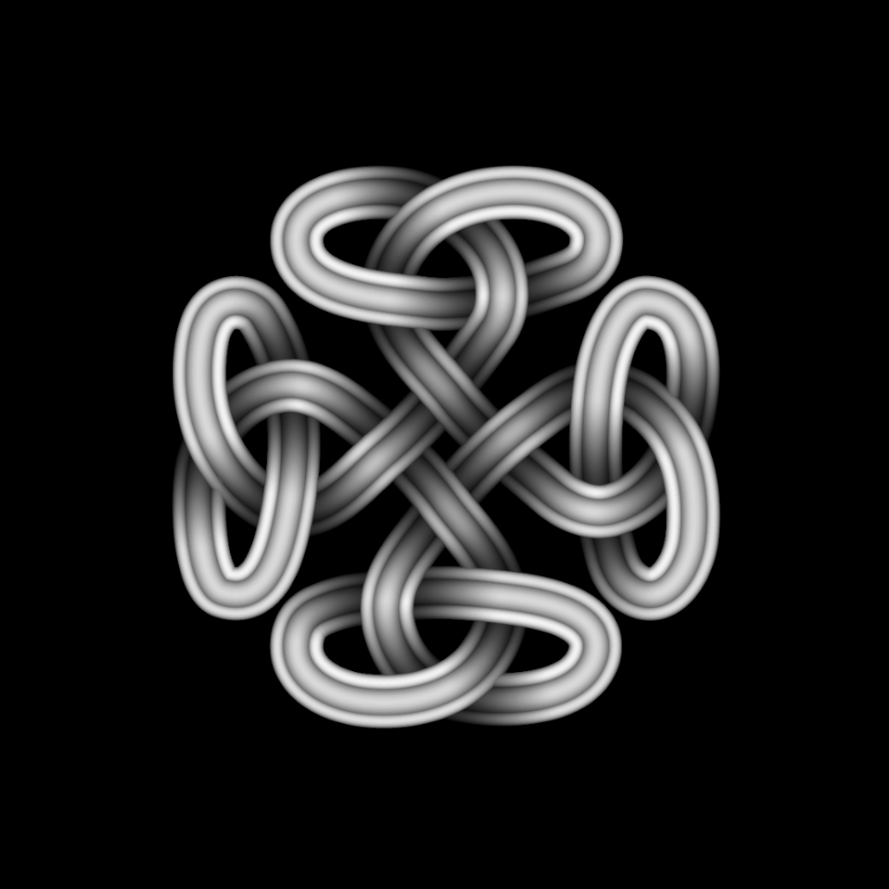
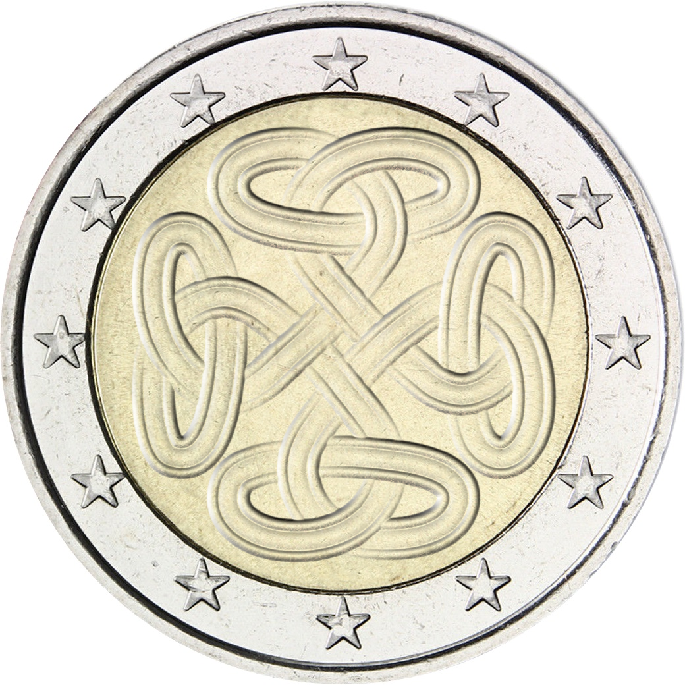

# CoinDesigner  

Generates 2 euro coin designs from bumpmaps  

Takes a black and white bumpmap of your coin design as input and exports your coin as output.  

For the input:  

  

You get output:  

  

## Installation  

Have python3 installed in your computer.  

Clone this repository with:  

    git clone https://github.com/joaoperfig/CoinDesigner  

Move into the new folder with:  

    cd CoinDesigner  

Install requirements with:  

    pip install -r requirements.txt  

## Usage  

Place your black and white template into the inputs folder.  

Call the renderer by using  

    python designer.py inputs/inputname.png outputs/outputname.png  

Your output image should be on the output folder.  

Additional parameters can be used:  

    python designer.py inputs/inputname.png outputs/outputname.png -s 0.1 -it 2 -nmd 1.5  

These will change the look and intensity of the output. Experiment with some values to find out.  
